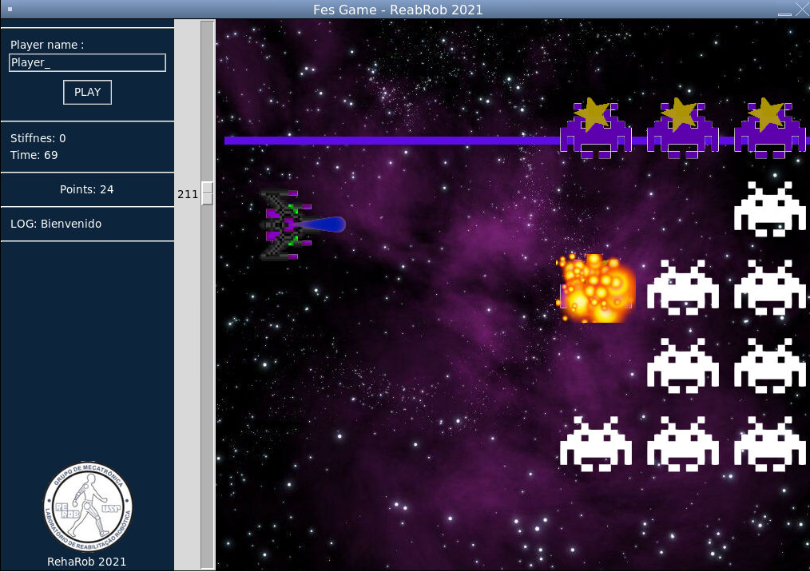

## README.md

El objetivo es crear un juego serio para el robot "AkelBot".
El funcionamiento del mismo está determinando por la rotacion del tobillo, en sus dos direcciones, el sistema de estimulación electrica Rehamove3 actuará cuando la derivada de la trayectoria sea positiva, intentando compensar y ayudar al movimiento.

### GAME

